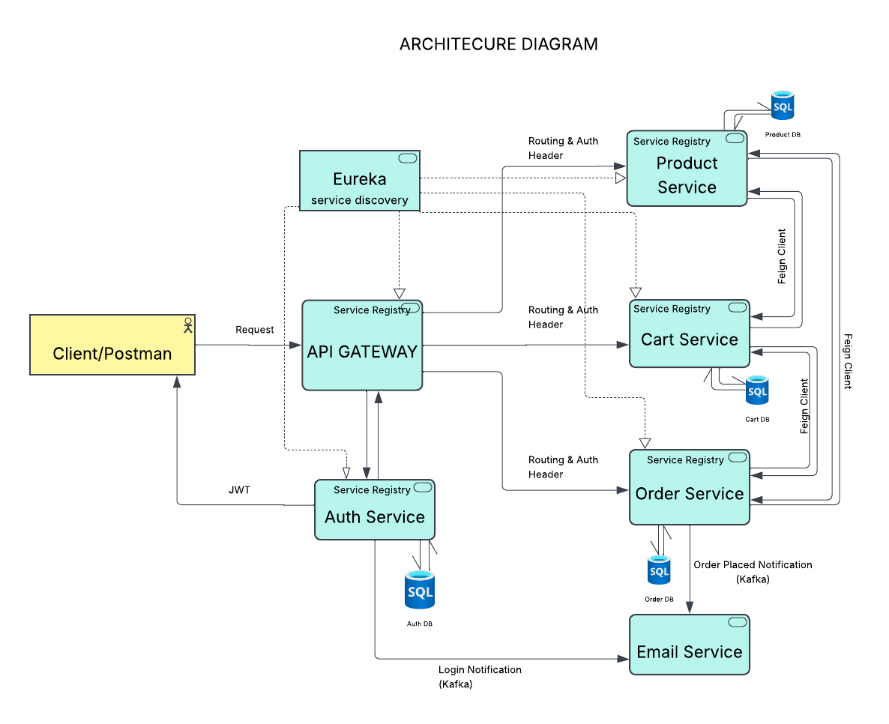
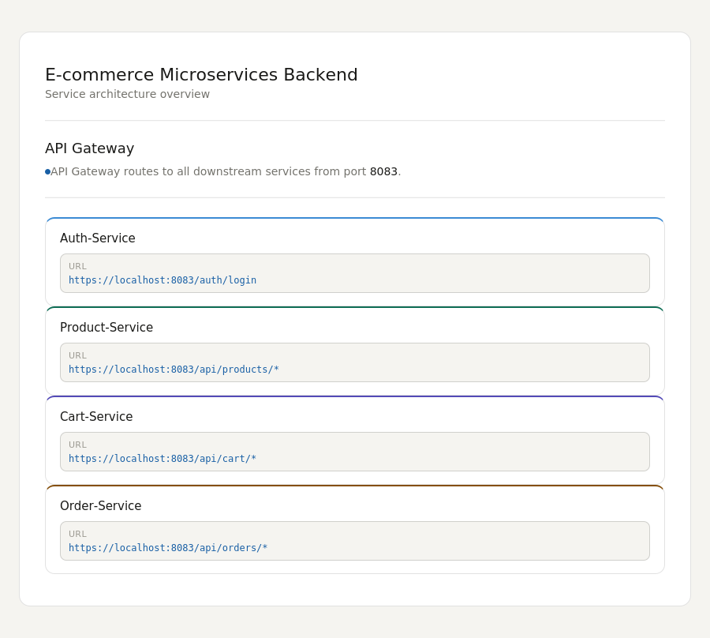
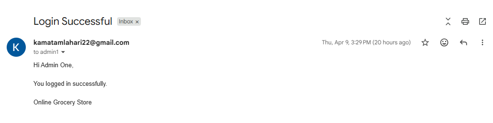
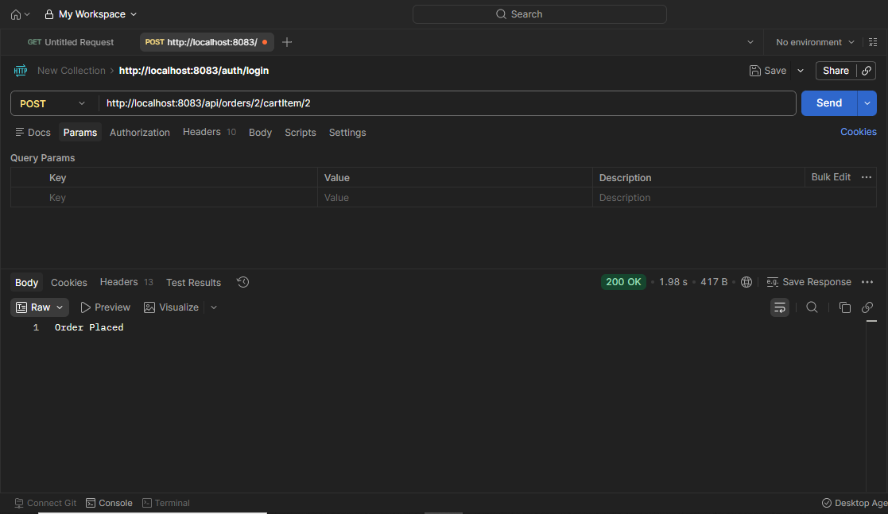
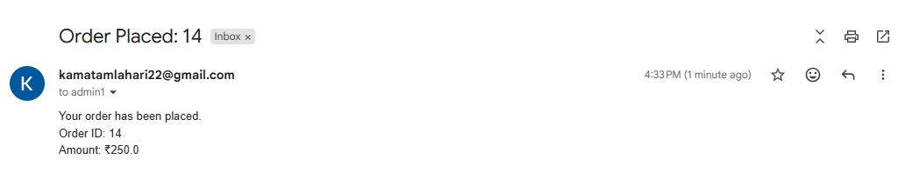

# 🛒 E-Commerce Microservices Backend

A production-ready e-commerce backend built with Java and Spring Boot using a microservices architecture. Features JWT authentication with RBAC, service discovery, Redis rate limiting, Kafka-driven notifications, circuit breaker fault tolerance, and deployment on AWS EC2.

---

## 📐 Architecture



> All client requests flow through the API Gateway, which handles routing and auth headers. Services register with Eureka for dynamic discovery and communicate synchronously via Feign Client or asynchronously via Kafka.

---

## 🧩 Services

| Service | Description | Database |
|---|---|---|
| **API Gateway** | Single entry point — routing, auth headers, Redis rate limiting | Redis |
| **Auth Service** | Login, registration, JWT token issuance | MySQL |
| **Product Service** | Product catalog and inventory management | MySQL |
| **Cart Service** | User cart management, talks to Product Service via Feign | MySQL |
| **Order Service** | Order processing, talks to Cart & Product via Feign | MySQL |
| **Email Service** | Sends notifications triggered by Kafka events | — |
| **Eureka Server** | Service registry and discovery for all microservices | — |

---

## 🔄 Request Flow

```
Client / Postman
      │
      ▼
  API Gateway  ──── Eureka (service discovery)
      │
      ├──► Auth Service     →  JWT token returned to client
      │
      ├──► Product Service
      │
      ├──► Cart Service     ──(Feign)──► Product Service
      │
      └──► Order Service    ──(Feign)──► Cart / Product Service
                │
                └──(Kafka)──► Email Service  (order placed notification)

Auth Service ──(Kafka)──► Email Service  (login notification)
```

---

## ✨ Key Features

- **JWT Authentication** with Role-Based Access Control (RBAC)
- **Eureka Service Discovery** for dynamic service registration
- **OpenFeign** for clean, type-safe inter-service HTTP calls
- **Redis Rate Limiting** at the API Gateway level
- **Circuit Breaker** with Resilience4j for fault tolerance and graceful degradation
- **Kafka Event-Driven Messaging** for async email notifications (order placed & login)
- **Distributed Tracing** with Zipkin across all services
- **Dockerized** services deployed on **AWS EC2**
- **Unit & Integration Tests** with JUnit and Mockito

---

## ⚙️ Tech Stack

| Layer | Technology |
|---|---|
| Language | Java 17 |
| Framework | Spring Boot, Spring MVC, Spring Security |
| Auth | JWT (JSON Web Tokens), RBAC |
| Service Discovery | Spring Cloud Netflix Eureka |
| API Gateway | Spring Cloud Gateway + Redis |
| Inter-service Comm | OpenFeign |
| Messaging | Apache Kafka |
| Fault Tolerance | Resilience4j (Circuit Breaker) |
| Tracing | Zipkin |
| Database | MySQL |
| Cache / Rate Limit | Redis |
| Containerization | Docker |
| Cloud | AWS EC2 |
| Testing | JUnit, Mockito |

---

## 🚀 Getting Started

### Prerequisites

- Java 17+
- Maven
- Docker & Docker Compose
- Apache Kafka & Zookeeper (or via Docker)

### Run with Docker Compose

```bash
git clone https://github.com/laharikrkv/your-repo-name.git
cd your-repo-name
docker-compose up --build
```

### Run Manually

Start services in this order to respect dependencies:

```bash
# 1. Eureka Server
cd eureka-server && mvn spring-boot:run

# 2. Auth Service
cd auth-service && mvn spring-boot:run

# 3. Product Service
cd product-service && mvn spring-boot:run

# 4. Cart Service
cd cart-service && mvn spring-boot:run

# 5. Order Service
cd order-service && mvn spring-boot:run

# 6. Email Service
cd email-service && mvn spring-boot:run

# 7. API Gateway (last)
cd api-gateway && mvn spring-boot:run
```

---

## 🔑 Authentication

All protected endpoints require a Bearer token in the `Authorization` header.

```bash
# 1. Register
POST /auth/register
{
  "username": "john",
  "email": "john@example.com",
  "password": "secret"
}

# 2. Login — returns JWT token
POST /auth/login
{
  "email": "john@example.com",
  "password": "secret"
}

# 3. Use token in subsequent requests
Authorization: Bearer <your_jwt_token>
```

---

## 📡 API Endpoints

### Auth Service — `/auth`
| Method | Endpoint | Auth | Description |
|---|---|---|---|
| `POST` | `/auth/register` | Public | Register a new user |
| `POST` | `/auth/login` | Public | Login and receive JWT token |

### Product Service — `/api/products`
| Method | Endpoint | Auth | Description |
|---|---|---|---|
| `POST` | `/api/products` | ADMIN | Create a new product |
| `GET` | `/api/products` | Public | Get all products |
| `GET` | `/api/products/{id}` | Public | Get product by ID |
| `PUT` | `/api/products/{id}` | ADMIN / `write:products` | Update product |
| `PATCH` | `/api/products/{id}/stock` | ADMIN / `write:products` | Update stock quantity |
| `DELETE` | `/api/products/{id}` | `delete:products` | Delete product |
| `GET` | `/api/products/validate/{id}/{quantity}` | Internal | Validate stock availability |

### Cart Service — `/api/cart`
| Method | Endpoint | Auth | Description |
|---|---|---|---|
| `POST` | `/api/cart/{userId}/add?productId=&quantity=` | `write:cart` | Add item to cart |
| `GET` | `/api/cart/{userId}` | `read:cart` | Get user's cart |
| `GET` | `/api/cart/{userId}/cart/{id}` | `read:cart` | Get specific cart item |

### Order Service — `/api/orders`
| Method | Endpoint | Auth | Description |
|---|---|---|---|
| `POST` | `/api/orders/{userId}/cartItem/{itemId}` | `write:orders` | Place an order from cart item |
| `GET` | `/api/orders/user/{userId}` | `read:orders` | Get all orders for a user |
| `GET` | `/api/orders/{id}` | `manage:orders` | Mark order as delivered |

---

## 📸 Screenshots

<!-- Replace the image paths below with your actual screenshots -->

| API Gateway Routing | Kafka Email Notification |
|---|---|
|  |  |

| Order Placement | Auth - Register & Login |
|---|---|
|  |  |

---

## 🎬 Demo

<!-- Replace the link and thumbnail below with your actual demo video -->
[![Demo Video]](https://drive.google.com/file/d/119srY5eTEvJJ00NpxgHnDScEONei3eks/view?usp=drive_link)

> Click the thumbnail above to watch the full demo.

---

## 🧪 Running Tests

```bash
# Run tests for a specific service
cd product-service
mvn test

# Run all tests from root (if using Maven multi-module)
mvn test
```

---

## ☁️ Deployment (AWS EC2)

```bash
# Build Docker images
docker-compose build

# Push to Docker Hub
docker push your-dockerhub/service-name:latest

# On EC2 instance
ssh -i your-key.pem ec2-user@your-ec2-ip
docker-compose up -d
```

---

## 📁 Project Structure

```
ecommerce-microservices/
│
├── eureka-server/
├── api-gateway/
├── auth-service/
├── product-service/
├── cart-service/
├── order-service/
├── email-service/
├── docker-compose.yml
└── README.md
```

---

## 👩‍💻 Author

**Lahari K**
- GitHub: [@laharikrkv](https://github.com/laharikrkv)
- LinkedIn: [LinkedIn Profile](www.linkedin.com/in/k-lahari-98a0043a5)
- Email: laharik157@gmail.com

---

## 📄 License

This project is open source and available under the [MIT License](LICENSE).
